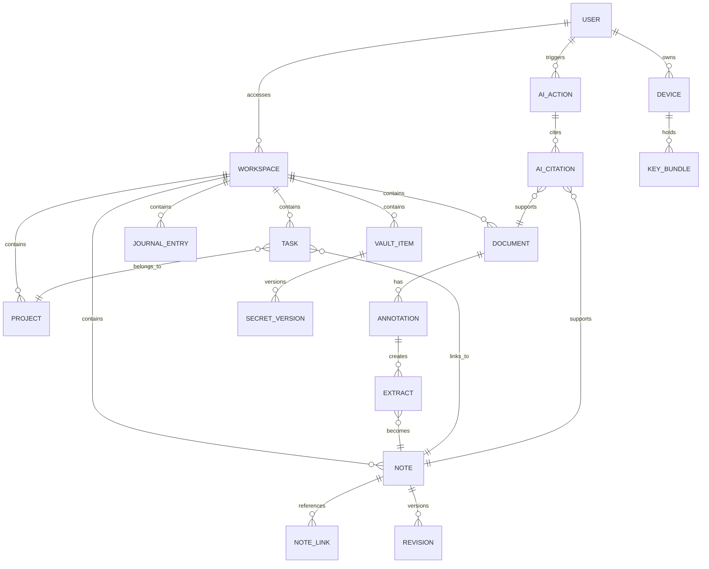
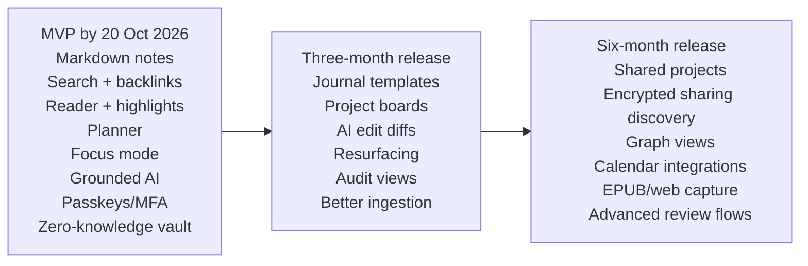

# Requirements specification for an AI-native markdown knowledge web application

## Executive summary

This specification converts the prior evidence-based product analysis into a prioritised, testable requirements set for a **web-based, markdown-first personal knowledge application** that combines note-taking, second-brain workflows, reading, research, planning, journalling, calm writing, project tracking, and an encrypted vault. The evidence is strongest for features that improve **capture, review, retrieval, linking, annotation, planning, and secure storage**; it is weaker for prescribing one universal focus ritual such as Pomodoro, so focus support should be configurable rather than doctrinaire. citeturn5search21turn2search10turn2search12turn2search11turn6search0turn6search2turn3search3turn3search21

The recommended product strategy is therefore to ship an MVP centred on **markdown notes, linked knowledge retrieval, document reading and annotation, grounded AI assistance, task planning, calm writing controls, robust authentication, and a zero-knowledge encrypted vault**. Collaboration, richer project views, and advanced sharing should follow in later releases once the personal workflow is stable, because the personal PIM and learning-science evidence is clearer than the evidence for complex team features in an early product. citeturn5search21turn2search0turn2search1turn8search6turn6search3

For security and privacy, the specification assumes a **zero-knowledge architecture for vault data**: server-side systems may store ciphertext, metadata, and synchronisation state, but must not possess vault plaintext or long-term decryption keys. Authentication should support **passwords, passkeys, and MFA**, with **Argon2id** for password hashing, **WebAuthn** for passkeys, and conservative client-side cryptography built on standard, audited primitives rather than custom protocol design. citeturn22view0turn0search2turn1search0turn11search0turn1search2turn0search1turn0search4turn14search7

For AI, the governing principle is **augmentation with provenance and human control**. AI actions should be retrieval-grounded, explainable to the extent the system can show source passages and transformation steps, rate-limited, interruptible, and safe by default when external documents or prompts are untrusted. AI should enhance memory, synthesis, and planning without silently replacing user judgement. citeturn12search1turn12search2turn12search17turn18search7turn23search0

## Scope, assumptions, personas, and design constraints

This specification assumes a **consumer or prosumer web application** for individual use at launch, with optional collaboration later. It assumes no immediate sector-specific compliance target beyond strong general security and privacy engineering. It further assumes that the canonical content model is markdown-first, that AI services may be third-party but replaceable, and that calendar and file integrations are desirable but not required for MVP.

### Personas and primary use-cases

The personas below are inferred because none were explicitly provided. They reflect the use-cases implied by the research: PIM, sensemaking, learning support, attention control, reflective writing, and secure storage. citeturn5search21turn2search11turn2search12turn6search0turn7search4turn0search1

| Persona | Primary goals | Most important use-cases | Product implications |
|---|---|---|---|
| **Independent knowledge worker** | Capture ideas, organise notes, retrieve context quickly | Simple notes, second brain, PKB, planner | Fast capture, backlinks, search, saved views, low-friction editing |
| **Research-driven learner** | Read, annotate, connect sources, learn deeply | Reader, research workspace, AI grounded summaries, question generation | Highlighting, source extraction, citations, AI Q&A with provenance |
| **Reflective planner** | Run daily and weekly life from one calm workspace | Planner, journalling, calm writing, focus sessions | Templates, reviews, task-to-note links, distraction control |
| **Security-conscious builder** | Store credentials and sensitive snippets safely | Encrypted vault, device management, recovery | Zero-knowledge vault, passkeys, MFA, recovery key UX |
| **Future project lead** | Track personal projects, later collaborate lightly | Projects, kanban-style tracking, shared artefacts | WIP-aware boards, status, ownership, later sharing model |

The primary use-cases and their strongest evidence bases are as follows.

| Use-case | What the app must enable | Evidence basis |
|---|---|---|
| **Simple note-taking** | Create, edit, review, and retrieve notes efficiently | Note-taking has positive encoding effects, while review and retrieval substantially strengthen learning outcomes. citeturn2search10turn2search12turn2search1 |
| **Second brain** | Externalise ideas into linked, reusable notes rather than dead storage | PIM research frames keeping, finding, and re-finding as core; sensemaking research shows value in iterative organisation and reuse. citeturn5search21turn2search11 |
| **Personal knowledge base** | Maintain durable mappings between information and future need | PIM emphasises organising, maintaining, retrieving, and integrating information across time. citeturn5search21 |
| **Research workspace** | Read documents, annotate them, extract passages, connect evidence | Sensemaking and digital annotation research support foraging, highlighting, annotation, and synthesis. citeturn2search11turn8search6turn8search4 |
| **Planner** | Convert goals into scheduled, concrete next actions | Goal-setting and implementation intentions improve action and performance; plan-making reduces the cognitive load of unfinished goals. citeturn6search0turn6search11turn6search2 |
| **Project tracking** | Visualise work, status, and constraints | Team cognition and WIP research support visible shared state and constrained work-in-progress. citeturn6search3turn6search4turn6search14 |
| **Journalling** | Support reflection, gratitude, and emotional labelling without therapeutic overclaiming | Reflective writing has modest benefits; expressive writing and gratitude interventions show small but real gains in some contexts. citeturn7search4turn7search0turn7search2turn7search17 |
| **Calm writing** | Minimise task switching and interruption burden | Task-switching, interruption, and calm-technology research all favour reduced fragmentation and attention-respecting interfaces. citeturn3search1turn3search0turn3search2turn16search1 |
| **Encrypted vault** | Store secrets reversibly but securely, unlike account passwords | Vault content needs encryption; account passwords need one-way hashing. Modern guidance favours strong hashing, key management, and zero-knowledge style separation. citeturn22view0turn0search1turn0search4 |
| **Enjoyable reader** | Make on-screen reading navigable, annotatable, and less cognitively brittle | Digital reading outcomes improve with better annotation, navigation cues, and suitable screen contexts. citeturn3search23turn3search11turn8search6turn8search4turn8search2 |

### Explicit design constraints

These constraints should be treated as non-negotiable design inputs, not backlog items.

| Constraint | Requirement consequence | Basis |
|---|---|---|
| **Web app** | Must run in modern browsers; installable and offline-capable enhancements are desirable but not mandatory for MVP | PWAs and modern web apps can deliver app-like behaviour from one codebase. citeturn10search10 |
| **Markdown-first** | Markdown is the canonical authoring format for notes, journal entries, extracts, and AI transformations | Product direction from owner; supported by note-taking and PIM rationale for durable, portable representations |
| **en-GB language** | Default spelling, dates, labels, and AI style should use British English | Product-owner constraint |
| **Client-side crypto for vault** | Vault encryption/decryption must occur in the browser, not on the server | OWASP cryptographic storage and key management guidance strongly support protecting keys and avoiding unnecessary plaintext exposure. citeturn0search1turn0search4 |
| **E2EE zero-knowledge vault** | Server stores ciphertext and limited metadata only; no server-side plaintext escrow for vault data | Security architecture requirement grounded in cryptographic-storage and key-management principles. citeturn0search1turn0search4 |
| **Progressive enhancement** | Essential reading, viewing, and basic editing must start from a resilient baseline; enhancement layers may depend on newer browser features | Progressive enhancement provides baseline functionality first, enhancing where supported. citeturn10search0turn10search4 |
| **Accessibility** | Must meet **WCAG 2.2 AA** at launch for core journeys | WCAG 2.2 is the current W3C accessibility recommendation. citeturn1search5turn1search11 |

## Prioritised and testable product requirements

### Functional requirements

| ID | Requirement | Acceptance criteria | Success metric | Dependencies and notes | Release |
|---|---|---|---|---|---|
| **FR-NOTES** | The system shall provide **create, edit, autosave, version, preview, export, and full-text search** for markdown notes. This is foundational because note-taking and review support memory and re-use. citeturn2search10turn5search21 | A user can create a note, edit in markdown and rich preview, recover prior versions, and export to `.md` within one session; autosave loss on refresh is zero in test runs | Weekly active writers; median notes created per active writer; save failure rate <0.1% | Markdown parser, renderer, version store | **MVP** |
| **FR-LINKS** | The system shall support **wiki links, backlinks, tags, note relationships, and saved views** so notes can function as a second brain rather than a flat archive. citeturn5search21turn2search11 | Creating `[[Link]]` generates a resolvable relation; backlink panel updates within 1 second; saved views filter by tag, date, and relation | Linked-note ratio; retrieval success in user tests; search-to-open conversion | Search index, graph relation store | **MVP** |
| **FR-PKB** | The system shall provide **re-finding features**: recent history, starred notes, pinned collections, and semantic filters for anticipated future need. citeturn5search21 | A user can retrieve a previously viewed note by title, tag, date, or recent-history panel in under 3 interactions in test scenarios | Median time-to-refind; % successful re-find tasks | Metadata store, search | **MVP** |
| **FR-RESEARCH** | The system shall support **document import, highlighting, annotation, extract-to-note, and source-linked citations** for personal research and context integration. citeturn2search11turn8search6turn8search4 | User can upload PDF/EPUB/text, highlight a passage, create an extract note with source pointer, and reopen the original passage reliably | Import-to-first-highlight rate; highlight-to-note conversion; citation re-open success | File ingestion, reader, annotation layer, secure upload handling | **MVP** |
| **FR-READER** | The reader shall provide **clean typography, annotation, stable location cues, chunked reading or pagination, and distraction-light controls** to improve digital reading usability. citeturn3search23turn3search11turn8search2turn8search4 | Reader offers toggleable paged/continuous views, persistent highlights, progress indicators, and typography preferences; opening the same document restores place | Average read session length; annotation rate per document; reader abandonment rate | Reader engine, rendering pipeline | **MVP** |
| **FR-PLANNER** | The system shall provide **daily, weekly, and scheduled task planning**, including due dates, start dates, review cadence, calendar links, and next-action prompts. citeturn6search0turn6search11turn6search2 | A task can be created from a note, assigned date/time, shown in daily and weekly views, and marked with a concrete next action | Weekly planning completion; task completion rate; overdue-task ageing | Task engine, optional calendar sync | **MVP** |
| **FR-PROJECTS** | The system shall support **personal project boards** with status columns, task-note links, and optional WIP limits; shared projects are deferred. citeturn6search3turn6search14 | User can create a project, add tasks, move tasks across statuses, and optionally set WIP per column; warnings appear when limits exceeded | Project activation rate; average cycle time; WIP-limit compliance | Task engine, board UI | **Next release** |
| **FR-JOURNAL** | The system shall provide **journal templates**, including daily reflection, gratitude, decision journal, and free-form entry modes. It must not present itself as therapy. citeturn7search4turn7search0turn7search2turn7search17 | User can start a journal entry from a template or blank page; entries can be private, dated, and excluded from AI by default if chosen | Journal streak retention; template usage mix; opt-out rate for AI processing | Notes engine, privacy controls | **Next release** |
| **FR-CALM** | The writing environment shall include **focus mode**, notification suppression, collapsible chrome, and optional timed work/break sessions, but must not hard-code one single ritual. citeturn3search0turn3search2turn16search1turn3search3turn3search21 | User can enter focus mode with hidden non-essential UI; optional timers include self-regulated, 25/5, and custom presets; no timer is required to write | Focus-mode adoption; session completion; interruption count per session | Editor shell, preference store | **MVP** |
| **FR-VAULT** | The system shall provide a **vault** for passwords, keys, tokens, and secret notes, stored separately from normal notes and encrypted client-side. citeturn0search1turn0search4 | User can create, classify, search, reveal, copy with timeout, rotate, and version a secret; server stores ciphertext only in architecture tests | Vault adoption; secret retrieval success; clipboard auto-clear success | Client crypto, auth, secure clipboard handling | **MVP** |

### AI requirements

| ID | Requirement | Acceptance criteria | Success metric | Dependencies and notes | Release |
|---|---|---|---|---|---|
| **AI-GROUNDED** | AI features shall be **retrieval-grounded** against user-authorised notes and documents, with visible citations or source pointers for every non-trivial answer. This aligns with trustworthy AI and the learning benefits of retrieval. citeturn12search1turn12search12turn2search1 | For any AI answer over a configurable threshold length, the UI shows the supporting note/document chunks; user can open each source | Citation coverage rate; source-open rate; user trust score | Search index, retrieval layer, UI provenance components | **MVP** |
| **AI-LEARNING** | AI shall support **summarisation, note distillation, self-explanation prompts, question generation, and spaced resurfacing** of relevant dormant notes. citeturn2search12turn2search1turn2search15turn2search2 | User can ask AI to summarise, generate questions, produce “explain simply” prompts, or schedule resurfacing intervals; all outputs link back to source material | AI task acceptance rate; resurfaced-note revisit rate; generated-question reuse | AI orchestration, scheduler | **Next release** |
| **AI-CONTROL** | AI shall be **human-in-the-loop** for destructive or consequential actions: no silent overwrites, no auto-send, no auto-delete, no autonomous task completion without confirmation. NIST treats human-AI configuration and oversight as core governance requirements. citeturn12search17turn12search2 | Every edit, task mutation, and classification change produced by AI is shown as a diff or preview with approve/reject options | Approval rate; rollback rate; number of silent mutations = 0 | Diff engine, action audit | **MVP** |
| **AI-EXPLAIN** | AI outputs shall expose a **basic explanation model**: what sources were used, what transformation was applied, and where uncertainty remains. citeturn12search1turn12search14 | UI shows source list, action label such as “summary” or “question generation”, and uncertainty notice when evidence is weak or conflicting | User-rated clarity of AI output; unresolved-source warnings surfaced | Provenance model, prompt templates | **MVP** |
| **AI-SAFETY** | AI features shall enforce **rate limits, quota controls, provider timeouts, prompt-injection defences, and fallback behaviour** when models or providers fail. Untrusted document text must be treated as adversarial input. citeturn18search7turn18search1turn23search0turn23search12 | On provider outage or timeout, the UI degrades to search, manual workflows, and queued retry options; prompt-injection tests block policy-violating document instructions in staging | AI failure recovery success; blocked prompt-injection findings; p95 AI latency | Guardrail layer, provider abstraction, rate limiter | **MVP** |

### Security, privacy, non-functional, and data model requirements

| ID | Requirement | Acceptance criteria | Success metric | Dependencies and notes | Release |
|---|---|---|---|---|---|
| **SEC-THREATS** | The product shall maintain an explicit threat model covering **server compromise, XSS, stolen credentials, phishing, malicious upload content, prompt injection, device loss, and future malicious collaborators**. citeturn19search0turn19search3turn18search7turn23search1 | Threat model document exists, is versioned, and is updated before each release; security tests map to named threats | % releases with updated threat review; open critical risks | Security review process | **MVP** |
| **SEC-AUTH** | Authentication shall support **passwords, passkeys, and MFA**, with passkeys presented as the preferred option for improved phishing resistance. citeturn1search0turn11search0turn1search2turn15search9 | User can register with password or passkey; enrol additional passkeys; enable MFA; log in with fallback paths; phishing-resistance messaging is visible in onboarding | Passkey adoption; MFA adoption; auth failure rate | WebAuthn stack, identity service | **MVP** |
| **SEC-PASSWORDS** | Password credentials shall be stored only with **Argon2id** and unique salts; never with reversible encryption. citeturn22view0turn0search2turn0search1 | Hash inspection in tests shows Argon2id parameters; no plaintext or reversible password storage paths exist | % accounts on Argon2id = 100; legacy hash count = 0 | Identity service, password upgrade migration | **MVP** |
| **SEC-VAULT-CRYPTO** | Vault items shall use **client-side authenticated encryption**, secure random generation, and key separation between account auth and vault decryption materials. citeturn21view2turn14search15turn0search4 | Encryption/decryption occurs only on client; ciphertext integrity failures are detected; architecture test proves server cannot decrypt vault payloads | Zero plaintext on server audits; cryptographic test pass rate | Browser crypto, key derivation, device key store | **MVP** |
| **SEC-RECOVERY** | Recovery shall distinguish between **account recovery** and **vault recovery**. Account recovery may reset login access; vault recovery must not reveal plaintext to the server. Recovery codes and secondary authenticators should be supported. citeturn15search0turn15search4turn0search4 | User can recover account through approved flow without informational leakage; vault recovery works only with user-held recovery material; no support path can read vault contents | Recovery success rate; support tickets requiring manual intervention; security incident count | Recovery UX, key escrow decision, MFA | **MVP** |
| **SEC-WEB** | The web app shall enforce **HTTPS**, secure headers, CSP, sanitised markdown rendering, file-upload restrictions, and XSS defences appropriate to a client-side crypto app. citeturn19search18turn19search10turn19search2turn19search1turn24search0turn19search3 | Security headers are present in automated checks; markdown rendering strips executable payloads; uploads validate extension, MIME, and scanning policy | External security scan pass rate; XSS findings; malicious upload block rate | Reverse proxy, renderer, sanitisers | **MVP** |
| **PRIVACY** | The service shall minimise stored personal data and logs, excluding secret content and sensitive fields from logs and analytics pipelines. NIST and OWASP both emphasise privacy risk management and exclusion of secret data from logs. citeturn20search4turn9search1turn9search2turn9search7 | Analytics payload review shows no secret values; security logs exclude plaintext notes, vault content, and keys; privacy settings are user-visible | Logged-secret incidents = 0; privacy-setting usage; DSR completion time | Privacy review, analytics governance | **MVP** |
| **NFR-ACCESS** | Core journeys shall meet **WCAG 2.2 AA**, including keyboard access, focus visibility, colour contrast, screen-reader labels, reduced-motion support, and accessible error states. citeturn1search5turn1search11 | Independent accessibility audit passes for note creation, search, reader, planner, auth, and vault; all core actions are keyboard-accessible | Automated a11y issue count; audit pass rate | Design system, QA | **MVP** |
| **NFR-PROGRESSIVE** | The product shall follow **progressive enhancement**: reading, sign-in, basic navigation, and basic note rendering must remain available from a resilient baseline, with advanced editing and AI layered on top. citeturn10search0turn10search4 | With JS disabled or partially failed, users can still authenticate, read notes, and reach help and export surfaces; enhanced features load conditionally | Baseline journey success rate; JS-error tolerance | SSR/HTML baseline, enhancement layers | **MVP** |
| **NFR-PERF** | The application shall feel lightweight enough to preserve calm interaction: search, note open, preview render, and reader navigation must meet explicit latency budgets. This is a product requirement derived from attention and interruption costs, not merely engineering hygiene. citeturn3search0turn3search2turn16search1 | p95 note open <500 ms, local search results <300 ms, page navigation <250 ms on supported class devices; offline cached notes re-open instantly after first sync | p95 latency, crash-free sessions, offline reopen success | Caching, indexing, telemetry | **MVP** |
| **DATA-MODEL** | The product shall maintain a normalised model for **notes, documents, annotations, extracted citations, tasks, projects, journal entries, vault items, AI actions, and revisions**, with stable IDs and source pointers. | Export/import round-trips preserve IDs and relationships; deleting a source leaves an auditable broken-reference state rather than silent corruption | Referential-integrity error rate; export/import success | Data schema, migration strategy | **MVP** |
| **DATA-AUDIT** | The product shall record **user-visible audit trails** for security events, AI actions, vault access history, and destructive content changes. | User can inspect recent security events, AI edits, and vault item access metadata without revealing secret plaintext in logs | Audit-view usage; unexplained event rate | Event model, privacy filters | **Next release** |

## Cross-cutting architecture, data model, measures, and delivery risks

### Recommended standards and implementation libraries

These are **recommended** rather than mandatory, but they align well with the constraints and current standards landscape.

| Area | Recommended standard or library | Why it fits | Caution |
|---|---|---|---|
| **Passkeys** | **WebAuthn**; implementation helper such as **SimpleWebAuthn** | WebAuthn is the W3C standard for public-key web credentials; SimpleWebAuthn reduces implementation friction. citeturn11search0turn14search2 | Treat helper libraries as wrappers around the standard, not the standard itself |
| **Password hashing** | **Argon2id** per RFC 9106 and OWASP guidance | Modern memory-hard hashing for account credentials. citeturn0search2turn22view0 | Parameter tuning must match operational capacity |
| **Client-side crypto** | Browser **Web Crypto API** with conservative wrappers; optionally **libsodium.js** for higher-level primitives | Web Crypto is the platform primitive; libsodium.js offers a safer higher-level abstraction for web contexts. citeturn14search3turn14search7turn14search0turn14search8 | MDN explicitly warns that SubtleCrypto is easy to misuse; avoid inventing protocols. citeturn14search7 |
| **Markdown processing** | **remark/unified** or **markdown-it** | Both support extensible markdown parsing and transformation. citeturn24search2turn24search1 | Rendering untrusted markdown requires sanitisation |
| **HTML sanitisation** | **DOMPurify** | Widely used client-side sanitiser for unsafe HTML/MathML/SVG. citeturn24search0turn24search9 | Sanitise after markdown-to-HTML conversion; combine with CSP |
| **Future encrypted sharing** | **Signal Double Ratchet** concepts or audited implementations for real-time secure sharing / messaging | Appropriate for forward-secret message exchange if live sharing is added later. citeturn1search4 | Not needed for a local single-user vault MVP |
| **Media provenance** | Optional future support for **C2PA** for attached media provenance | Useful if the product later manages AI-generated or externally shared media where authenticity matters. citeturn13search0turn13search1 | Not a substitute for source citations in text UX |

### Conceptual data model

The data model below reflects the minimum structure needed to support notes, research, tasks, vaults, and AI provenance while preserving portability.

This model is justified because PIM depends on mappings between information and future need, while research and AI provenance require durable links among notes, documents, annotations, and extracted evidence. citeturn5search21turn2search11turn12search12

### Success metrics and KPIs

These KPIs translate the research into observable product outcomes.

| Goal | KPI | Suggested target |
|---|---|---|
| **Capture value** | Weekly active writers / monthly active users | >35% by month 3 |
| **Knowledge reuse** | % notes with at least one link, tag, or citation | >50% by month 6 |
| **Re-finding quality** | Median time-to-refind previously used note | <30 seconds |
| **Reader quality** | Import-to-highlight conversion rate | >40% for imported documents |
| **Planning utility** | Weekly review completion rate | >25% active users |
| **Calm interaction** | Mean interruptions surfaced during focus sessions | Decreasing trend by month 3 |
| **AI trust** | % AI answers with visible provenance | 100% for non-trivial answers |
| **AI usefulness** | AI output acceptance rate | >55% for summary and extraction actions |
| **Security posture** | Passkey adoption among new sign-ups | >40% by month 6 |
| **Vault trust** | Plaintext exposure incidents in logs/server storage | 0 |
| **Accessibility** | WCAG 2.2 AA audit pass for core journeys | 100% before launch |
| **Reliability** | Crash-free sessions | >99.5% |

### Key assumptions, dependencies, and risks

| Topic | Assumption or risk | Product implication |
|---|---|---|
| **Single-user first** | Collaboration is deferred | Simplifies permissions, sync conflicts, and cryptographic sharing |
| **AI provider risk** | Third-party models may be unavailable, slow, or policy-changing | Provider abstraction and fallback are mandatory |
| **Client-side crypto risk** | Browser crypto is feasible but easy to misuse | Keep cryptographic surface small; prefer audited patterns and wrappers |
| **XSS severity** | XSS is especially dangerous in a client-side crypto app because it threatens decrypted data in-session | CSP, sanitisation, Trusted Types, and rigorous rendering boundaries are release blockers |
| **Reader complexity** | Great reading UX across PDF, EPUB, and web pages is hard | Start with PDF/plain text, add EPUB and web capture later |
| **Pomodoro evidence** | Break structures help some users, but one rigid timer is not universally superior | Offer presets and self-regulation, not a mandated 25/5 mode |
| **Recovery tension** | Better recovery often weakens zero-knowledge guarantees | Make trade-offs explicit and default towards security |
| **Data portability** | Markdown portability can be undermined by proprietary metadata | Keep note bodies portable and sidecar metadata exportable |

## Prioritisation and roadmap

### Feature priority, effort, and risk comparison

The table below synthesises user value, evidence strength, delivery complexity, and operational risk.

| Feature area | Priority | Effort | Risk | Why this order |
|---|---|---:|---:|---|
| Markdown notes, search, versions | **Highest** | Medium | Low | Core value with strong evidence and manageable complexity |
| Linking, backlinks, PKB views | **Highest** | Medium | Low | Essential for second-brain/PKB identity |
| Document reader, highlights, extract-to-note | **Highest** | High | Medium | Strong differentiation; more UI complexity |
| Grounded AI with citations | **Highest** | High | Medium | Strong value if provenance is done well; credibility collapses without it |
| Planner and daily/weekly review | **High** | Medium | Low | Direct behavioural value supported by planning science |
| Calm writing and focus mode | **High** | Low | Low | High UX upside with modest build effort |
| Vault with zero-knowledge client crypto | **High** | High | High | High trust value, but security-critical and easy to get wrong |
| Journalling templates | **Medium** | Low | Low | Valuable and straightforward; not launch-critical |
| Personal project boards | **Medium** | Medium | Medium | Useful, but can follow note/planner maturity |
| Advanced spaced resurfacing and learning tools | **Medium** | Medium | Medium | Valuable after grounded AI primitives exist |
| Shared projects and encrypted sharing | **Later** | High | High | Requires permissions, sync conflict handling, and stronger security design |
| Real-time secure collaboration using ratcheted protocols | **Later** | Very high | High | Separate product problem; defer until clear demand |

### MVP, three-month, and six-month roadmap table

Dates are shown explicitly from the current date **20 July 2026**.

| Window | Target date | Deliverables | Exit criteria |
|---|---|---|---|
| **MVP** | **20 July 2026 to 20 October 2026** | Markdown notes; search; backlinks; document reader for PDFs and plain text; highlights and extract-to-note; daily/weekly planner; focus mode; grounded AI chat and summaries with citations; auth with password/passkey/MFA; Argon2id password hashing; zero-knowledge vault; WCAG 2.2 AA on core flows | Users can write, read, plan, ask grounded AI questions, and store secrets without breaking core security or accessibility requirements |
| **Three-month release** | **By 20 October 2026** | Journal templates; project boards; AI diff-and-edit flows; resurfacing scheduler; improved file ingestion; audit views for AI and security events; richer reader controls | Product demonstrates durable weekly use across notes, reading, planning, and vault |
| **Six-month release** | **By 20 January 2027** | Shared project spaces; optional encrypted sharing architecture discovery; richer knowledge graph views; calendar integrations; EPUB/web capture; advanced review workflows; optional media provenance features | Product can support power users and early small-team workflows without compromising trust or clarity |

### Roadmap diagram

The core recommendation is to treat the application less as a bundle of adjacent utilities and more as a **coherent cognitive environment**. That means the MVP should not try to be everything at once. It should first be a first-rate place to **write, connect, read, retrieve, plan, and protect** information, with AI acting as a transparent assistant and the vault treated as a trust-critical subsystem with stricter launch gates than ordinary note features. That prioritisation most closely matches the strongest available evidence from PIM, learning science, attention research, and current security and AI standards. citeturn5search21turn2search12turn3search0turn12search1turn0search1turn1search5