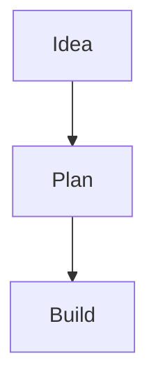

# Cleaned product direction

You are not building a Notion clone. You are building a **beautiful, fast, Markdown-first personal workspace**.

## Product definition

**inkest** is an English-first personal notes and lightweight project-management app. It stores notes as Markdown, supports Mermaid diagrams, images, local filesystem storage, RTL writing when needed, and small explicit AI actions for summarizing, rewriting, extracting tasks, and generating project plans.

## Core principles

1. **UI/UX first**
   The app should feel calm, minimal, and premium before it feels feature-rich.

2. **Markdown-native**
   Notes are stored as Markdown text, not complex block JSON.

3. **Private by default**
   Self-hosted MVP, local filesystem attachments, Turso/libSQL database.

4. **Project management as notes**
   Projects should be special notes with status, priority, due date, tasks, and linked notes.

5. **AI as a helper, not the product**
   AI should be triggered intentionally by the user. No automatic sending of private notes to AI.

6. **English-first, RTL-ready**
   Main UI is English. Individual notes can be `ltr`, `rtl`, or `auto`.

---

# Recommended MVP stack

Use:

```txt
Next.js App Router
TypeScript
Tailwind CSS
shadcn/ui
Drizzle ORM
Turso / libSQL
CodeMirror 6
react-markdown
remark-gfm
rehype-sanitize
Mermaid
Auth.js
Local filesystem attachment storage
OpenAI API or compatible provider
```

Next.js App Router is a good fit because the app needs page layouts, server-side data access, mutations, and API routes in one project structure; current Next.js docs describe Server Functions/Server Actions for data mutations. ([Next.js][1])

Turso/libSQL with Drizzle is suitable for this project because Drizzle officially supports the libSQL/Turso driver, and Turso provides a documented Next.js integration path. ([orm.drizzle.team][2])

CodeMirror is appropriate for the Markdown editor because it is an extensible browser code editor component. Mermaid is appropriate for Markdown diagrams, but use `securityLevel: "strict"` or `"sandbox"` because Mermaid’s sandbox mode renders diagrams in a sandboxed iframe and prevents JavaScript from running in the page context. ([codemirror.net][3])

For AI actions that return tasks, project plans, or metadata, use structured JSON responses. OpenAI’s Structured Outputs are designed to make model output conform to a supplied JSON schema. ([OpenAI Developers][4])

---

# MVP feature scope

## Must-have

```txt
Authentication
Dashboard
Note list
Create/edit/delete notes
Markdown editor
Markdown preview
Mermaid rendering
Image upload into local filesystem
Tags
Folders or collections
Search
Project note type
Tasks from Markdown checkboxes
RTL/LTR/auto direction per note
Basic AI actions
Settings page
Export notes as Markdown
```

## Should-have after MVP

```txt
Note version history
Backlinks
Daily notes
Kanban view
Command palette
Keyboard shortcuts
Import Markdown folder
AI chat with selected notes
Embeddings / semantic search
Theme customization
```

## Avoid in MVP

```txt
Realtime collaboration
Mobile app
Complex block editor
Full Jira-style project management
End-to-end encryption
Vector database
Plugin system
Public sharing
Multi-tenant team workspaces
```

---

# Information architecture

Main navigation:

```txt
Home
Notes
Projects
Daily
Tags
Archive
Settings
```

Secondary UI:

```txt
Command palette
Global search
New note button
AI action menu
Theme toggle
Direction toggle
```

Recommended app layout:

```txt
┌─────────────────────────────────────────────┐
│ Top bar: search, command menu, new note     │
├───────────────┬─────────────────────────────┤
│ Sidebar       │ Main editor/preview area    │
│ - Notes       │                             │
│ - Projects    │ Markdown editor             │
│ - Daily       │ Preview                     │
│ - Tags        │ Metadata panel              │
└───────────────┴─────────────────────────────┘
```

---

# UI/UX direction

## Visual style

Use a calm “writing studio” style:

```txt
Background: warm off-white / soft dark mode
Typography: excellent readability
Spacing: generous
Borders: subtle
Interaction: fast and quiet
Animation: minimal
Density: medium-low
```

## Design references in words

The experience should feel like:

```txt
Linear's polish
Obsidian's Markdown power
Apple Notes' simplicity
Notion's organization, but without heaviness
Raycast's command-driven speed
```

## Core screens

### 1. Home dashboard

Show:

```txt
Recent notes
Pinned notes
Active projects
Due tasks
Quick capture
```

### 2. Notes list

Features:

```txt
Search
Filter by tag
Filter by type
Sort by updated date
Pinned notes
Archive
```

### 3. Note editor

Modes:

```txt
Edit
Preview
Split
Focus
```

Right metadata panel:

```txt
Type
Status
Priority
Due date
Tags
Direction
Created/updated dates
AI actions
```

### 4. Project view

A project is a note with structured metadata.

Tabs:

```txt
Overview
Tasks
Notes
Timeline
```

### 5. Settings

```txt
Profile
Theme
Editor preferences
AI provider
Storage path
Export
Danger zone
```

---

# Data model

Use a clean schema that does not overcomplicate the first version.

```txt
users
- id
- email
- name
- password_hash nullable
- image nullable
- created_at
- updated_at

workspaces
- id
- user_id
- name
- slug
- created_at
- updated_at

notes
- id
- user_id
- workspace_id
- parent_id nullable
- title
- slug
- content_md
- excerpt nullable
- type: note | project | daily
- direction: ltr | rtl | auto
- status: none | todo | doing | done | paused | archived
- priority: none | low | medium | high
- due_date nullable
- pinned boolean
- archived boolean
- deleted_at nullable
- created_at
- updated_at

tags
- id
- user_id
- workspace_id
- name
- slug
- color nullable
- created_at

note_tags
- note_id
- tag_id

tasks
- id
- note_id
- user_id
- title
- description nullable
- status: todo | doing | done | canceled
- priority: none | low | medium | high
- due_date nullable
- source: manual | markdown | ai
- source_line nullable
- created_at
- updated_at

attachments
- id
- user_id
- note_id nullable
- file_name
- original_name
- mime_type
- size_bytes
- width nullable
- height nullable
- storage_path
- public_path nullable
- checksum nullable
- created_at

note_versions
- id
- note_id
- user_id
- title
- content_md
- created_at

ai_events
- id
- user_id
- note_id nullable
- action
- input_hash
- output_md nullable
- output_json nullable
- provider
- model
- created_at
```

For MVP, `note_versions` can be delayed, but leave the schema planned.

---

# Local filesystem storage design

Use this structure:

```txt
/storage
  /attachments
    /{userId}
      /{year}
        /{month}
          /{attachmentId}-{safeFileName}
  /exports
    /{userId}
  /tmp
```

Environment variables:

```env
STORAGE_DRIVER=local
LOCAL_STORAGE_ROOT=./storage
MAX_UPLOAD_SIZE_MB=20
ALLOWED_UPLOAD_TYPES=image/png,image/jpeg,image/webp,image/gif,image/svg+xml
```

Upload flow:

```txt
1. User selects image.
2. Server validates auth.
3. Server validates MIME type and size.
4. Server creates attachment id.
5. Server writes file to local storage.
6. Server writes metadata to attachments table.
7. API returns Markdown snippet:
   
```

Attachment serving:

```txt
GET /api/attachments/:id
- Check auth.
- Check ownership.
- Read file from local path.
- Return file with correct content-type.
```

Do not expose `/storage` directly as a public static folder for private files.

---

# Markdown rules

Support:

```txt
CommonMark
GitHub-flavored Markdown
Tables
Task lists
Code blocks
Mermaid blocks
Images
Internal note links
```

Internal link format:

```md
[[Project Alpha]]
[[Project Alpha#Decisions]]
```

Image format:

```md

```

Mermaid format:

````md

````

Security rules:

```txt
Disable raw HTML by default.
Sanitize all rendered Markdown.
Sanitize links.
Render Mermaid client-side.
Use strict/sandbox Mermaid security.
Do not allow arbitrary script/event attributes.
```

---

# AI features

## MVP AI actions

Add an **AI menu** in the note editor:

```txt
Summarize note
Improve writing
Extract tasks
Create project plan
Generate Mermaid diagram
Explain selected text
Translate selected text
```

## AI rules

```txt
AI only runs after explicit user action.
Show exactly what content will be sent.
Allow selected text AI actions.
Allow whole-note AI actions.
Store AI history in ai_events.
Never send archived/deleted notes unless selected.
Never auto-train or auto-sync private notes.
```

## AI implementation pattern

Use server-side AI routes/actions:

```txt
server/ai/actions/summarize-note.ts
server/ai/actions/improve-writing.ts
server/ai/actions/extract-tasks.ts
server/ai/actions/create-project-plan.ts
server/ai/actions/generate-mermaid.ts
```

For structured actions, return JSON:

```json
{
  "tasks": [
    {
      "title": "Design database schema",
      "priority": "high",
      "dueDate": null
    }
  ]
}
```

For text actions, return Markdown:

```txt
## Summary
...

## Key points
...
```

---

# Project file structure

```txt
src
├── app
│   ├── (auth)
│   ├── (app)
│   │   ├── dashboard
│   │   ├── notes
│   │   ├── notes/[id]
│   │   ├── projects
│   │   ├── daily
│   │   ├── tags
│   │   └── settings
│   ├── api
│   │   ├── attachments/[id]
│   │   └── ai
│   └── layout.tsx
├── components
│   ├── app-shell
│   ├── editor
│   ├── markdown
│   ├── notes
│   ├── projects
│   ├── tasks
│   ├── ai
│   └── ui
├── server
│   ├── auth
│   ├── db
│   ├── notes
│   ├── projects
│   ├── tasks
│   ├── attachments
│   ├── ai
│   └── search
├── lib
│   ├── markdown
│   ├── mermaid
│   ├── rtl
│   ├── slug
│   ├── dates
│   └── validation
└── styles
```

---

# Implementation phases for the coding agent

## Phase 0 — Foundation

Goal: create the project, tooling, and base layout.

Tasks:

```txt
Initialize Next.js TypeScript app
Install Tailwind CSS
Install shadcn/ui
Set up ESLint and Prettier
Set up environment variables
Create base app shell
Create light/dark theme
Create empty dashboard
Create responsive layout
```

Acceptance criteria:

```txt
App runs locally
Dashboard route works
App shell has sidebar and topbar
Theme toggle works
No TypeScript errors
No lint errors
```

---

## Phase 1 — Database and auth

Tasks:

```txt
Install Drizzle ORM and libSQL/Turso client
Create schema
Create migrations
Add Auth.js
Add user session helper
Protect app routes
Create default workspace after signup/login
```

Acceptance criteria:

```txt
User can sign in
Protected routes redirect unauthenticated users
Database migrations run
User has default workspace
```

---

## Phase 2 — Notes CRUD

Tasks:

```txt
Create note server actions
Create note list
Create note detail page
Create new note flow
Create autosave or manual save
Create soft delete/archive
Create pinned notes
Create note metadata panel
```

Acceptance criteria:

```txt
User can create, edit, archive, delete notes
Note list updates correctly
Only owner can access notes
Editor saves Markdown content
```

---

## Phase 3 — Markdown editor and preview

Tasks:

```txt
Install CodeMirror 6
Build Markdown editor component
Add edit/preview/split modes
Install react-markdown
Add remark-gfm
Add rehype-sanitize
Create Markdown preview component
Support task lists and tables
```

Acceptance criteria:

```txt
Markdown renders safely
Task lists render correctly
Tables render correctly
Editor supports keyboard input smoothly
Split mode works
```

---

## Phase 4 — Mermaid support

Tasks:

```txt
Detect fenced mermaid code blocks
Create MermaidRenderer component
Render diagrams client-side
Handle Mermaid errors gracefully
Use strict or sandbox security mode
Add loading and error states
```

Acceptance criteria:

```txt
Mermaid diagrams render in preview
Invalid Mermaid code does not crash page
Security mode is configured
```

---

## Phase 5 — Local image uploads

Tasks:

```txt
Create local storage service
Create upload endpoint/action
Validate file type and size
Write file to /storage/attachments
Create attachment DB row
Create private attachment serving route
Add image insert button in editor
Return Markdown image snippet
```

Acceptance criteria:

```txt
User can upload image
Image is stored locally
Image appears in Markdown preview
Unauthorized users cannot access private attachments
```

---

## Phase 6 — Tags, folders, and search

Tasks:

```txt
Create tags CRUD
Add tag selector to note metadata
Add note filtering by tag
Add parent_id note hierarchy
Create sidebar tree
Add SQLite/Turso search
Normalize English/Persian text for search
```

Acceptance criteria:

```txt
User can tag notes
User can search title/content
User can filter by tag
Sidebar hierarchy works
```

---

## Phase 7 — Project notes and tasks

Tasks:

```txt
Add project note type
Add project list view
Add status, priority, due date
Parse Markdown checkboxes into task view
Allow manual tasks
Create project task tab
Create simple kanban board
```

Acceptance criteria:

```txt
User can create project note
Project appears in projects page
Markdown checkboxes appear as tasks
Kanban view shows tasks by status
```

---

## Phase 8 — AI actions

Tasks:

```txt
Create AI provider abstraction
Add OpenAI-compatible provider
Create AI action menu
Implement summarize note
Implement improve writing
Implement extract tasks
Implement create project plan
Implement generate Mermaid
Add loading/error states
Store ai_events
```

Acceptance criteria:

```txt
AI actions run only when clicked
Selected text actions work
Whole note actions work
Extracted tasks can be inserted into note or task list
AI output can be accepted, copied, or discarded
```

---

## Phase 9 — Export and backup

Tasks:

```txt
Export all notes as Markdown files
Export attachments
Export metadata as JSON
Create zip export
Add single-note export
Add backup page in settings
```

Acceptance criteria:

```txt
User can export all data
Export contains readable Markdown
Images are included
Metadata is preserved
```

---

## Phase 10 — Polish and production readiness

Tasks:

```txt
Improve empty states
Improve loading states
Improve mobile responsive layout
Add keyboard shortcuts
Add command palette
Add error boundaries
Add audit of auth checks
Add Dockerfile
Add docker-compose.yml
Add README
```

Acceptance criteria:

```txt
UI feels polished
Docker deployment works
App can be self-hosted
Critical routes are protected
No obvious data exposure
```
